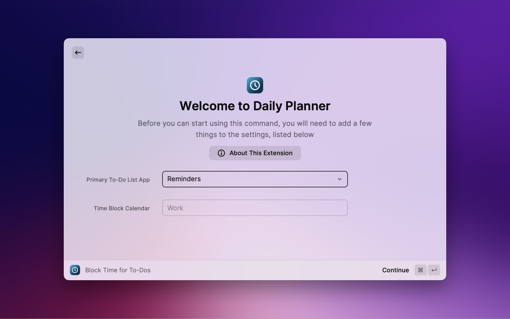
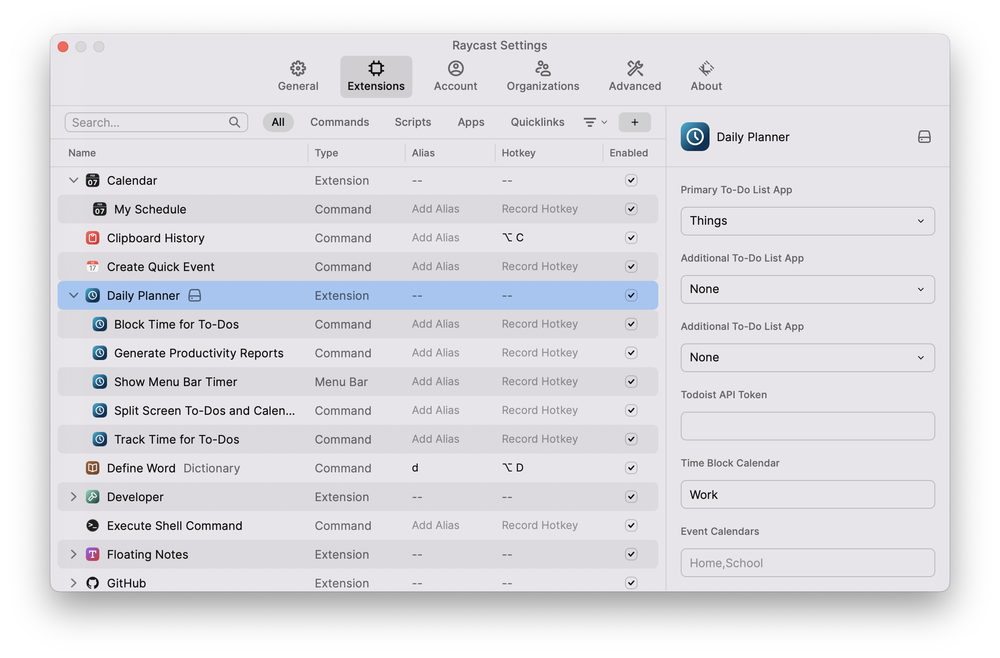

# Extension Settings

## Welcome Screen

When you start using the extension, you'll need to select your [Primary To-Do List App](#primary-to-do-list-app) and [Time Block Calendar](#time-block-calendar).

## Complete Extension Settings

To access and modify all available options, go to Raycast Settings > Extensions > Daily Planner.

## To-Do List Integration

The Daily Planner extension supports integration with three popular to-do list applications: **Reminders**, **Things**, and **Todoist**. Choose one app as your primary task manager and optionally select up to two additional apps to import tasks from.

### Primary To-Do List App

_**Required**_. The extension will create new tasks in this app by default. It will also adopt this app's keyboard shortcut schema. This is also the app that is displayed in split screen mode in the [“Split Screen To-Dos and Calendar”](split-screen.md) command.

### Additional To-Do List Apps

_Optional, up to 2_. Choose other task managers to import existing tasks from. The app icon next to each task will indicate the source of imported tasks. The tasks will be displayed in the order their source apps are selected.

### Todoist API Token

_Required only if selecting Todoist_. Enter your Todoist API token to enable integration. Find your API token in the Todoist web app under [Settings > Integrations > Developer](https://todoist.com/app/settings/integrations/developer).

## Calendar Integration

The Daily Planner extension puts all your time blocks on a single calendar but can also reference additional calendars to detect scheduling conflicts.

### Time Block Calendar

_**Required**_. This is the calendar where scheduled time blocks will be placed. If there is no calendar that has the name entered, you will be prompted to create it when launching a command.

### Event Calendars

_Optional_. The extension will check these calendars for events when suggesting time block schedules to avoid conflicts. You also will receive a reminder of any detected conflicts when scheduling a time block. Calendar events are accessed locally and not shared externally.

## Time Tracking Settings

Enable time tracking to log time spent on tasks. Choose between built-in calendar time tracking or integration with a dedicated time tracking service like Toggl or Clockify.

### Time Tracking App

_Required only if using [Track Time for To-Dos](track-time)_. Select "Calendar" for basic but complete offline and privacy-protected time tracking on your calendar. Or, choose "Toggl" or "Clockify" to integrate with their time tracking service and sync projects and tags[^1]. Leave the “Calendar for Time Tracking” and “Time Tracking Service API Key” fields blank to disable time tracking.

### Calendar for Time Tracking

_Required only if selecting Calendar time tracking_. This is the calendar where time entries will be logged. If there is no calendar that has the name entered, you will be prompted to create it when launching a command.

### Time Tracking Service API Key

_Required only if selecting Toggl or Clockify_. Enter your API key or access token to enable integration with the selected time tracking service. Find your API key from [Toggl Track Profile](https://track.toggl.com/profile) or [Clockify Profile Settings](https://app.clockify.me/user/settings).

### Sync Projects/Tags[^1]

_Applicable only to Toggl or Clockify_. Enable to sync projects and tags from your task manager to the time tracking service. Syncing will occur incrementally as you start timers for tasks associated with projects or tags.

[^1]: Project and tag sync with time tracking services is an optional convenience feature for Toggl and Clockify users. It allows you to keep your to-do list app data and time tracking app data in sync without manual copying and pasting. This sync is not required for grouping to-dos and time entries by project or tag in Productivity Reports.
